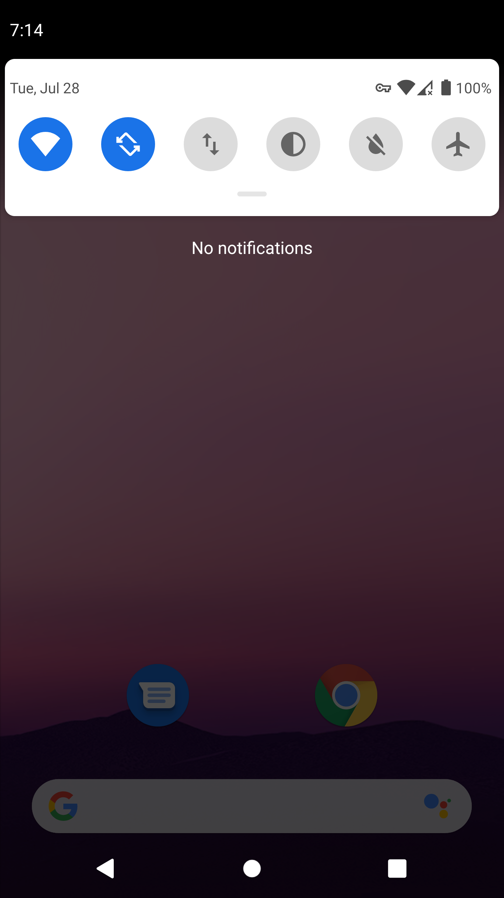
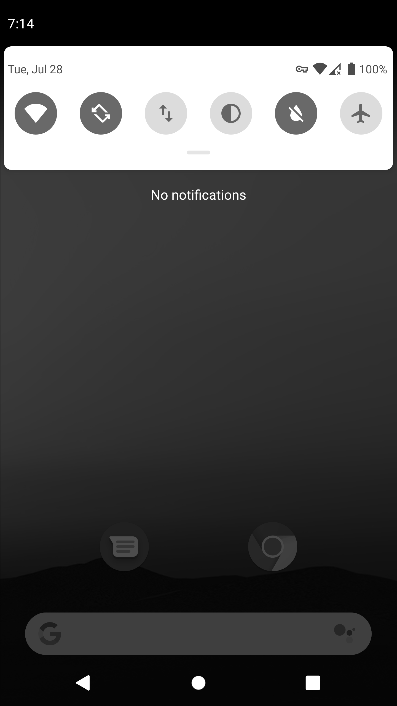

# 【翻】Greyscale (灰度)

原文链接在[这里](https://download.csdn.net/download/weixin_42159267/15256669)

Greyscale是Android的快速设置图块，可让您在彩色显示和灰度之间切换设备。

## 屏幕截图





## 如何使用

为了使用Greyscale，您必须手动授予权限，因为该权限通常不适用于第三方应用程序。 可以通过从命令行运行以下命令来通过adb完成此操作：

```
adb shell pm grant io.github.rsookram.greyscale android.permission.WRITE_SECURE_SETTINGS
```

如果以后要删除该权限，可以运行：

```
adb shell pm revoke io.github.rsookram.greyscale android.permission.WRITE_SECURE_SETTINGS
```

一旦完成，就[可以使用](https://support.google.com/android/answer/9083864?hl=zh-Hans)了。
